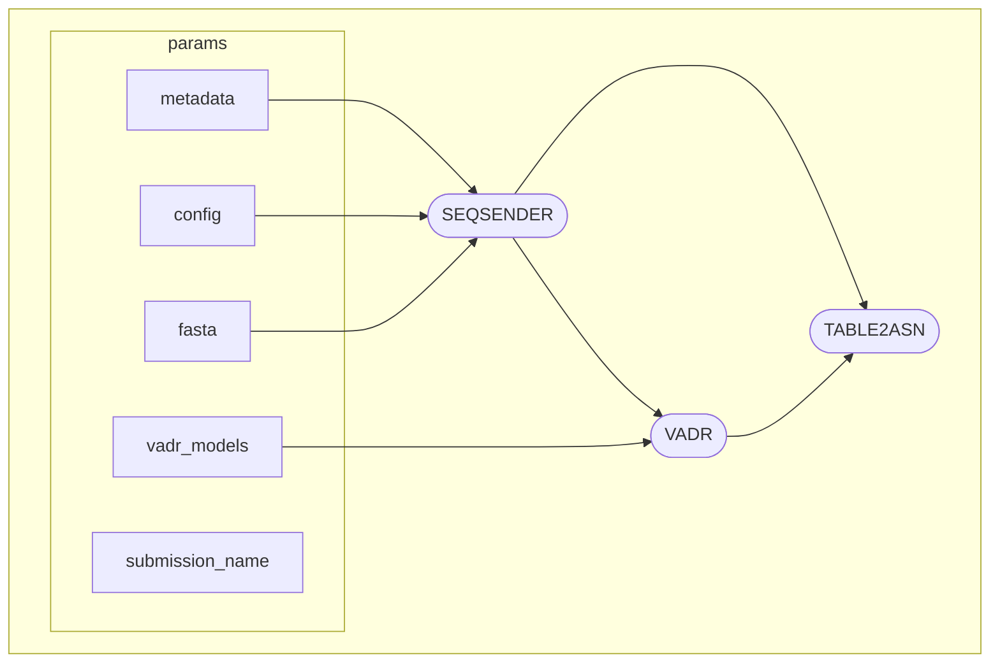

# VirGO: Viral Genome Submission File Orchestration
Created for non-flu, non-cov2 viral genome assembly submission prep for NCBI/Genbank. 

Nextflow pipeline orchestrating:
- `SeqSender` fasta+metadata file validation and .src + .sbt file generation, optional automated Biosample submission over FTP
- `VADR` annotation and optional trimming terminal N's
- `tbl2asn` submission-ready .sqn file generation 

Currently in use for Measles virus, WNV, flexible to inlcude other viruses which have VADR model representation. 

## Requirements

## Usage

### Step 1
Clone the repository to wherever you typically run Nextflow:
`git clone https://github.com/DOH-KEW4303/VirGO.git`

### Step 2
Run the command to initiate the workflow, insterting the appropriate paths to your input files:
`nextflow run main.nf \
-profile docker \
--submission_name MeV_VSP010 \
--config seqsender_config2025.yaml \
--metadata /path/to/metadata/file/your_meta.csv \
--fasta /path/to/fasta/file/your_fasta.fa \
--organism OTHER \
--vadr_models /path/to/vadr-model/folder`
