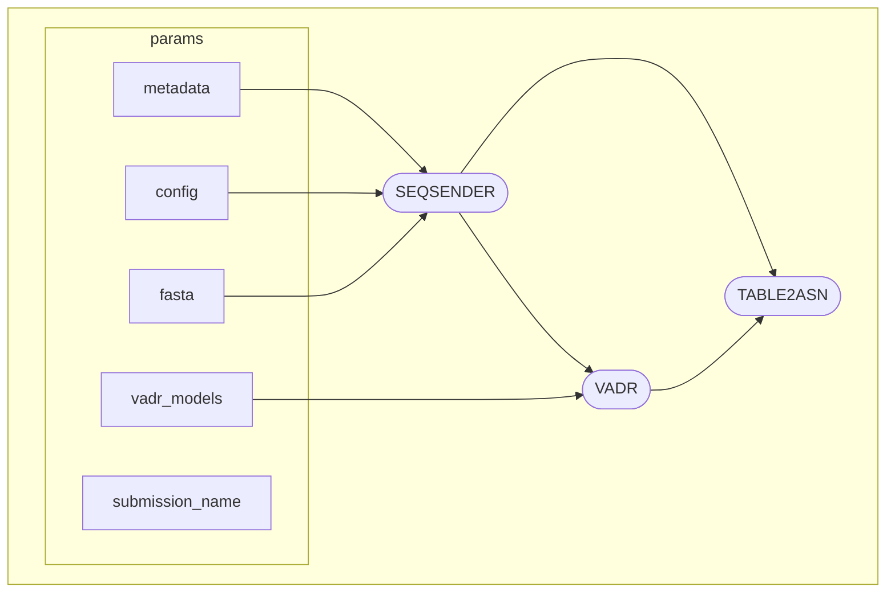

# VirGO: Viral Genome Submission File Orchestration
Created to streamline viral genome submission to NCBI for organisms that are not supported for fully automated submissions. Currently supports submission to BioSample and Genbank with SRA capacity in development. Tested with Measles virus and West Nile virus and can support any viral pathogen with VADR model representation. It is not designed for submission of influenza A, influenza B, or SARS-CoV-2 as these organisms are supported for fully automated submissions and do not require user-provided genome annotation. `Seqsender` is an excellent stand-alone tool for submission of these pathogens:
https://github.com/CDCgov/seqsender/tree/master

Nextflow pipeline orchestrating:
- `SeqSender` fasta+metadata file validation and .src + .sbt file generation, optional automated Biosample submission over FTP
- `VADR` annotation and optional trimming terminal N's
- `tbl2asn` submission-ready .sqn file generation 

```mermaid
flowchart TB
  subgraph " "
    subgraph params
      v2["metadata"]
      v0["submission_name"]
      v5["vadr_models"]
      v1["config"]
      v3["fasta"]
    end
    v7([SEQSENDER])
    v9([VADR])
    v11([TABLE2ASN])
    v1 --> v7
    v2 --> v7
    v3 --> v7
    v5 --> v9
    v7 --> v9
    v7 --> v11
    v9 --> v11
  end

```
---

## Requirements
- Nextflow (DSL2)
- Docker
- NCBI account credentials 

VirGO uses containerized tools (SeqSender, VADR, table2asn).  
These are automatically pulled during execution.

---

## Inputs

### Required

- Metadata CSV (`--metadata`)
- Single or multi-FASTA file (`--fasta`)
- VADR models (`--vadr_models`)
- SeqSender config file (`--config`)
  
⚠️ Metadata must currently be provided in a SeqSender-compatible form. See `templates/seq_metadata.csv` for a downloadable csv template. 

## Config file

VirGO requires a SeqSender configuration file.

### Downloadable template

`templates/seqsender_config_template.yaml`

### Notes

- update NCBI credentials, paths and submission-specific settings before running
- values must be appropriate for your environment
- this file is required for pipeline execution

---
## Parameters

### Required

| Parameter | Description |
|----------|------------|
| `--submission_name` | Name for this run (used in output directories) |
| `--organism` | Organism type (e.g., FLU, OTHER) |
| `--vadr_models` | Path to VADR model for specific pathogen |
| `--metadata` | Path to metadata CSV file |
| `--fasta` | Path to single or multi-fasta file (.fa) |
| `--config` | SeqSender configuration file |

---

### Optional

| Parameter | Default | Description |
|----------|--------|------------|
| `--submit_biosample` | true | Submit BioSample records over FTP |
| `--dry_run` | false | Run without live submission |

---
## Usage

### Step 1
Clone the repository to wherever you typically run Nextflow:
`git clone https://github.com/DOH-KEW4303/VirGO.git`

### Step 2
Run the command to initiate the workflow, insterting the appropriate paths to your input files:
`nextflow run main.nf \
-profile docker \
--submission_name MeV_VSP010 \
--config seqsender_config2025.yaml \
--metadata /path/to/metadata/file/your_meta.csv \
--fasta /path/to/fasta/file/your_fasta.fa \
--organism OTHER \
--vadr_models /path/to/vadr-model/folder`
